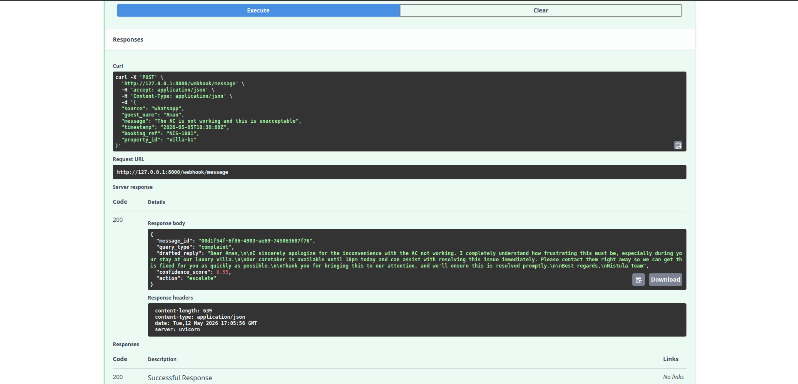

# Nistula Technical Assessment

AI-powered guest messaging backend system built using FastAPI and Claude API.

---

# Features

- Webhook endpoint for inbound guest messages
- Unified schema normalization
- AI-generated guest replies using Claude
- Query classification
- Confidence scoring
- Automated action routing
- PostgreSQL schema design

---

# Tech Stack

- Python
- FastAPI
- Anthropic Claude API
- PostgreSQL
- Pydantic

---

# Setup

## Clone Repository

```bash
git clone <repo_url>
cd nistula-technical-assessment
```

## Install Dependencies

```bash
pip install -r requirements.txt
```

## Configure Environment Variables

Create `.env`

```env
CLAUDE_API_KEY=your_key_here
```

## Run Server

```bash
uvicorn app.main:app --reload
```

---

# Endpoint

POST `/webhook/message`

## Example Request

```json
{
   "source": "whatsapp",
   "guest_name": "Rahul Sharma",
   "message": "Is the villa available from April 20 to 24?",
   "timestamp": "2026-05-05T10:30:00Z",
   "booking_ref": "NIS-2024-0891",
   "property_id": "villa-b1"
}
```

## Example Response

```json
{
   "message_id": "uuid",
   "query_type": "pre_sales_availability",
   "drafted_reply": "Hi Rahul! Yes, Villa B1 is available...",
   "confidence_score": 0.92,
   "action": "auto_send"
}
```

---

# Confidence Scoring Logic

| Situation | Confidence |
|---|---|
| Exact keyword classification | 0.90+ |
| General enquiries | 0.70 |
| Special requests | 0.82 |
| Complaints | 0.55 |

## Action Logic

- Above 0.85 → auto_send
- Between 0.60 and 0.85 → agent_review
- Below 0.60 → escalate

Complaints are always escalated.

---

# Design Decisions

- Used unified message schema for multi-channel consistency
- Used hybrid rule-based classification for explainability
- Separated escalation handling from messaging flow
- Added AI metadata support in database schema for future analytics

---

# Future Improvements

- Add Redis queue
- Add conversation memory
- Add multilingual support
- Add sentiment analysis
- Add AI fallback classification# nistula-technical-assessment

# API Screenshots

## Availability Query Response



---
